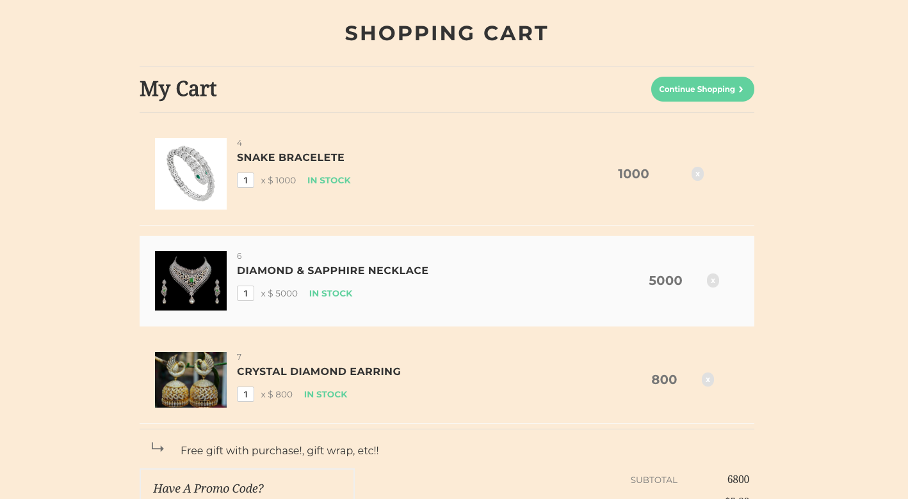

# WARDROBE

An interactive ecommerce website of jewelry, where you can see different category of items and buy it.

## GETTING STARTED

To play this game click on the link below and follow the instructions. Make sure your pop-up blocker is disabled.

[Wardrobe-by-mitali](https://wardrobemymitali.herokuapp.com/index)

#### OPTION :
* Fork and Clone this repository.
* Run `python -m SimpleHTTPServer` command into the source folder.
* Open browser at localhost:8000/page1.html
* Make sure your pop-up blocker is disabled.

### BEST FEATURE

 Make your girlfriend/wife happy by gifting these precious jewelry. User can checkout the collection, order it online and get it at the doorstep soon. User can also check the location on google maps and visit the store. 

### TECHNOLOGIES

* Bootstrap
* Postgresql
* HTML5 Canvas
* Knex
* JavaScript

